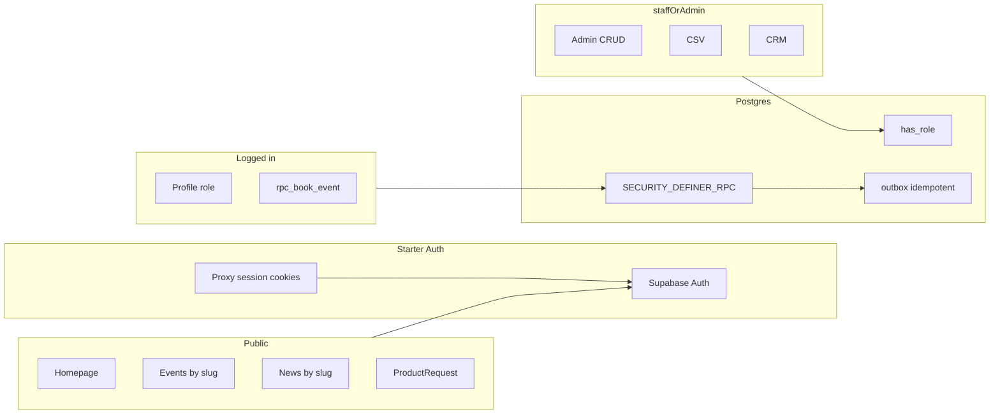

# Piano V1 — Game Store (estensione dello starter Vercel + Supabase)

## Decisioni architetturali chiuse (pre-implementazione)

Queste scelte sono **vincolanti**; niente alternative parallele in V1.

| # | Decisione | Approccio unico |
|---|-----------|-----------------|
| 1 | **Booking** | **Una sola** entrypoint RPC Postgres `SECURITY DEFINER` per tutto il ciclo prenotazione lato dominio (es. `event_registration_action(p_operation app_registration_action, ...)` con enum operazioni: `book`, `cancel`, `staff_check_in`, …). **Un corpo**, transazioni interne uniche per chiamata; **vietato** orchestrare booking con più RPC o query separate dall’app. L’app invoca **solo** questa `supabase.rpc(...)`. |
| 2 | **RLS** | Funzione SQL riusabile **`public.has_role(required app_role)`** (`STABLE`, `SECURITY DEFINER`, `search_path` fisso). **Tutte** le policy RLS devono usarla (nessuna duplicazione ad hoc di controlli ruolo inline). Semantica: gerarchia **`customer < staff < admin`** — es. `has_role('staff')` vero per `staff` e `admin`. |
| 3 | **Prenotazioni** | **Solo** tabella **`event_registrations`** con enum **`registration_status`** (`confirmed`, `waitlisted`, `cancelled`, `checked_in`, valori futuri additivi es. `pending_payment`). **Nessuna** tabella separata per waitlist. |
| 4 | **Slug** | **`events.slug`** e **`posts.slug`**: obbligatori per entità pubbliche, **UNIQUE** globalmente (o UNIQUE per scope se definito — default: unique globale con vincolo esplicito nel piano implementativo). URL pubblici basati su slug. |
| 5 | **jsonb** | **`metadata` / `payload` jsonb** ammessi solo per estensioni **non critiche** (es. extra outbox, preferenze UI). **Nessuna** regola di booking, capacità, ruolo o pagamento futuro deve dipendere da jsonb in V1. |
| 6 | **Outbox** | Tabella outbox **idempotente** e **retry-safe**: ad es. **`idempotency_key TEXT NOT NULL UNIQUE`**, più stati (`pending`, `processing`, `sent`, `failed`), timestamp di tentativi; inserimenti **ON CONFLICT DO NOTHING** o upsert controllato così i retry non duplicano invii. |
| 7 | **Product requests** | Oltre ai campi base: **`quantity` (int NULL)**, **`desired_price` (numeric NULL)**, **`priority_flag` (boolean default false)** — tutti opzionali per V1, pronti per preorder V2. |
| 8 | **Ruoli V1** | **Un solo ruolo per utente**: colonna **`profiles.role`** di tipo **`app_role`**, `NOT NULL`, default **`customer`**. **Niente** tabella `user_roles` in V1. Se in futuro servissero più ruoli, si aggiunge in modo **additivo** (nuova tabella + migrazione dati) senza rompere la colonna esistente. |
| 9 | **Chiusura decisioni** | Variabili d’ambiente **non** usate per admin. Nessun “forse RPC o query”. **Un** modello di slug, **un** enum registrazioni, **un** punto d’ingresso SQL per booking. |

---

## Vincoli di stabilità a lungo termine (obbligatori)

Ogni decisione deve superare il test: **«Funzionerà in V2/V3 solo con estensioni additive?»** Se no, non va implementata.

| Regola | Implicazione operativa |
|--------|-------------------------|
| Niente implementazioni usa-e-getta | Niente logica temporanea da sostituire; niente assunzioni che rompono a scala |
| Dominio estensibile | **Ruolo enum su `profiles`** (no boolean `is_staff`); **stati espliciti**; niente seconda tabella per waitlist |
| Preparare il futuro senza costruirlo | Colonne **nullable** per pagamenti su event/registration; campi prodotto opzionali; outbox per canali multipli |
| Disaccoppiamento | Regole in **`lib/domain/*`**; componenti **senza** capacità/booking inline |
| Booking production-ready | **Una RPC** per transazione; vincoli DB + partial unique su coppie attive; waitlist = stesso record, altro `status` |
| Autorizzazione scalabile | **`has_role`** in RLS e stessa semantica in TypeScript per UX (hide admin nav) — **no** `ADMIN_EMAILS` |
| DB = contratto | Slug, enum, timestamp; evoluzione additiva |
| Punti di estensione | Outbox idempotente; colonne pagamento NULL; jsonb solo non critico |

**Failure condition:** riscrivere auth, booking oltre l’aggiunta di RPC additive, split tabella registrations, o ruoli senza migrazione controllata → **INVALID**.

---

## Contesto

- [PRD.md](./PRD.md): V1 in scope; V2/V3 direzione only.
- Bootstrap in **root**; se la cartella non è vuota, spostare temporaneamente file di documentazione.
- **Nome package npm:** usare nome **lowercase** (es. `game-store`) — la cartella può restare `GameStore`, ma `package.json` **name** non può avere maiuscole (vincolo npm).

## Step 0 — Bootstrap ufficiale

1. Svuotare la directory di lavoro dai soli file che bloccano lo scaffold (es. `PRD.md`, `file.md` → backup temporaneo).
2. `npx create-next-app@latest . --example with-supabase` con flag non interattivi; **`package.json` → `"name": "game-store"`** (o simile) se il template deriva dal nome cartella maiuscolo.
3. Ripristinare `PRD.md` e `file.md`.
4. `.env.local`: supportare sia `NEXT_PUBLIC_SUPABASE_PUBLISHABLE_KEY` sia documento utente con `NEXT_PUBLIC_SUPABASE_ANON_KEY` (stesso valore se anon legacy).

## Step 1 — Ispezione architettura

Mappare il refresh sessione (nel repo: `proxy.ts` + `lib/supabase/proxy.ts`, equivalente funzionale al middleware dello starter) e `lib/supabase/*`. Helper lato app: **`userMeetsRole`** in `lib/auth/roles.ts` allineato a `has_role` in SQL.

## Step 2 — Modello dati

### Ruoli e profili

- Enum **`app_role`**: `customer`, `staff`, `admin`.
- **`profiles.role`** `NOT NULL DEFAULT 'customer'` (allineare allo starter: stesso `id` = `auth.users.id`).

### Eventi

- `event_categories`; **`events`** con `status`, `starts_at`/`ends_at`, `capacity`, **`slug` UNIQUE**, colonne nullable `price_cents`, `currency`, `deposit_cents` per V2.

### `event_registrations` (tabella unica)

- `registration_status` enum come sopra; **`waitlist_position` NULL** per ordine waitlist.
- **Partial unique index**: una riga attiva per utente/evento, es. unica su `(event_id, user_id)` dove `status IN ('confirmed','waitlisted')`.

### Booking — implementazione

- **Una sola funzione** `SECURITY DEFINER` con `SET search_path = public` (o schema esplicito): parametro operazione (enum) che instrada a branch interni nella **stessa** definizione PL/pgSQL. Per `book`: lock riga evento (`FOR UPDATE`), conta `confirmed`, insert `confirmed` vs `waitlisted` o errore, `waitlist_position`, eventuale riga **outbox** con `idempotency_key` deterministico (es. `booking:{event_id}:{user_id}`) nella **stessa** transazione. Per `cancel` / `staff_check_in`: stessa funzione, branch atomico. **Vietato** più funzioni RPC per booking o logica capacity dal client.

### CMS, newsletter, CRM, prodotti

- **`posts`**: `status`, **`slug` UNIQUE**, `published_at`, autore.
- `newsletter_subscribers`, `admin_notes` (RLS con `has_role('staff')`).
- **`product_reservation_requests`**: status enum; campi **`quantity`**, **`desired_price`**, **`priority_flag`**; note testuali; **nessuna** dipendenza da jsonb per stati core.

### Outbox

- Colonne minime: `id`, `idempotency_key` UNIQUE, `channel`, `payload` jsonb (solo contenuto messaggio, non regole business), `status`, `scheduled_at`, `attempt_count`, `last_error`, timestamps.
- Worker V1 opzionale; contratto pronto per retry idempotenti.

### RLS

- Ogni policy: **`has_role('staff')`** / **`has_role('admin')`** / `auth.uid() = ...` per dati propri.
- **Nessuna** policy che duplica la logica di `has_role` in linea.

## Step 3 — Applicativo

Server Actions → `lib/domain/booking.ts` (etc.) → **`.rpc()`** verso le funzioni sopra. UI senza logica di capacità.

## Step 4 — Comunicazioni

`lib/comms/enqueue.ts` inserisce in outbox con **idempotency_key** fornito dal dominio (es. dopo RPC booking).

## Diagramma alto livello

## Rischio noto

- Directory non vuota e **npm name**: usare nome package lowercase dopo lo scaffold.

---

## Stato implementazione (codice vs piano V1)

| Area | Stato |
|------|--------|
| Migrazioni SQL V1 (`supabase/migrations/20260404170000_gamestore_v1.sql` e successive) | Implementate nel repo |
| RPC unica `event_registration_action`, RLS via `has_role`, outbox idempotente | Implementate |
| Dominio `lib/domain/booking.ts`, `lib/comms/enqueue.ts`, worker batch `lib/comms/process-outbox.ts` | Implementate |
| Route cron worker | `GET /api/cron/outbox` con `Authorization: Bearer` + `OUTBOX_CRON_SECRET` e/o `CRON_SECRET` (Vercel) |
| Cron scadenza pagamenti evento | `GET /api/cron/expire-pending-event-payments` (stessi secret; opz. `EVENT_PAYMENT_PENDING_EXPIRE_HOURS`) — vedi [`vercel.json`](vercel.json) |
| Cron alert stock preordini | `GET /api/cron/product-stock-notifications` — accoda `product_stock_available` e opz. digest staff `product_stock_staff_summary` ([`lib/comms/product-stock-notifications.ts`](lib/comms/product-stock-notifications.ts), [`lib/comms/process-outbox.ts`](lib/comms/process-outbox.ts)); `PRODUCT_STOCK_SCAN_BATCH_LIMIT`, `PRODUCT_STOCK_EXPECTED_LOOKAHEAD_DAYS` (finestra opzionale su `expected_fulfillment_at`), `PRODUCT_STOCK_AUTO_CANCEL_GRACE_DAYS` (opz. annullamento automatico `awaiting_stock` con data attesa troppo vecchia), `PRODUCT_STOCK_STAFF_SUMMARY_EMAIL`; stessi Bearer secret |
| UI pubblica, `/protected`, `/admin`, CSV partecipanti | Implementate |
| Pagamenti evento (Stripe + RPC) | Migrazione [`20260414120000_event_registration_payment_flow.sql`](supabase/migrations/20260414120000_event_registration_payment_flow.sql): `confirm_payment` / `expire_payment`, `book` → `pending_payment` se prezzo/deposito; webhook [`app/api/webhooks/stripe/route.ts`](app/api/webhooks/stripe/route.ts); checkout da [`app/events/actions.ts`](app/events/actions.ts) |
| Enum `pending_payment` / estensioni additive | `pending_payment` su enum registrazione; operazioni RPC e UI allineate (`v2-event-payments` **completed** nel frontmatter) |
| Comms automation (reminder 24h) | [`lib/comms/event-reminders.ts`](lib/comms/event-reminders.ts), cron [`app/api/cron/event-reminders/route.ts`](app/api/cron/event-reminders/route.ts), UI [`/admin/comms`](app/admin/comms/page.tsx), design [docs/design-v2-comms-automation.md](docs/design-v2-comms-automation.md) |
| Campagne segmentate (primo slice) | Enqueue [`lib/comms/campaign-segment-enqueue.ts`](lib/comms/campaign-segment-enqueue.ts) da [`/admin/comms`](app/admin/comms/page.tsx) (segmenti `newsletter_opt_in`, `marketing_consent`); email `campaign_segment` in [`lib/comms/process-outbox.ts`](lib/comms/process-outbox.ts); tabella stub `comms_campaigns` in [`20260418140000_crm_audit_qr_window_comms_campaigns.sql`](supabase/migrations/20260418140000_crm_audit_qr_window_comms_campaigns.sql) |
| QR check-in (primo slice) | [`20260417120000_event_registration_check_in_token.sql`](supabase/migrations/20260417120000_event_registration_check_in_token.sql) + [`20260418140000_crm_audit_qr_window_comms_campaigns.sql`](supabase/migrations/20260418140000_crm_audit_qr_window_comms_campaigns.sql): token, `event_check_in_by_token` (finestra + slug), `staff_rotate_registration_check_in_token`; pagina [`app/events/check-in/[token]/page.tsx`](app/events/check-in/[token]/page.tsx); staff [`app/admin/events/[id]/page.tsx`](app/admin/events/[id]/page.tsx) |
| Metriche outbox email (debug staff) | RPC `outbox_email_stats_for_staff` ([`supabase/migrations/20260416180000_outbox_email_stats_for_staff.sql`](supabase/migrations/20260416180000_outbox_email_stats_for_staff.sql)); aggregati `kind` × `status` in [`/admin/comms`](app/admin/comms/page.tsx) |
| CRM staff (timeline) | Scheda cliente [`/admin/crm/…`](app/admin/crm/%5BprofileId%5D/page.tsx) (`[profileId]` dinamico): timeline unificata (note, iscrizioni, richieste prodotto, outbox email per `user_id`, audit `staff_crm_audit_log`) via [`lib/gamestore/data.ts`](lib/gamestore/data.ts) |
| Analytics staff (primo slice) | [`/admin/analytics`](app/admin/analytics/page.tsx): RPC `analytics_staff_summary` ([`supabase/migrations/20260419120000_analytics_staff_summary_for_staff.sql`](supabase/migrations/20260419120000_analytics_staff_summary_for_staff.sql)) con intervallo date; conteggi eventi, iscrizioni per stato, outbox `pending`, richieste prodotto |
| Check-in per evento, analytics campagne/waitlist, stock per profilo | Migrazione [`20260420140000_checkin_policy_analytics_campaign_waitlist_profile_stock.sql`](supabase/migrations/20260420140000_checkin_policy_analytics_campaign_waitlist_profile_stock.sql): `events.check_in_early_days` / `check_in_late_hours`, `profiles.stock_notification_lookahead_days`, `event_check_in_by_token` con titolo/data evento; RPC `analytics_outbox_campaign_segment_stats`, `analytics_waitlist_registration_summary`; UI admin eventi/CRM/analytics e cron stock allineati |
| Preordini / stock (incremento) | Migrazione [`20260415120000_product_requests_preorder_fields.sql`](supabase/migrations/20260415120000_product_requests_preorder_fields.sql): `expected_fulfillment_at`, `stock_notified_at`, stato `awaiting_stock` |
| Test automatici | `npm run test` (unit, inclusi payment checkout, event-reminders, dominio booking); `npm run verify:migrations` (elenco file SQL locale); `npm run smoke:test` (RPC remoto); `npm run verify:after-migrations` / `npm run verify:predeploy` (post-migrazioni e gate deploy); `npm run test:e2e` (Playwright); CI [`.github/workflows/ci.yml`](.github/workflows/ci.yml) |

**Gap operativo (ricorrente):** ogni modifica in [`supabase/migrations/`](supabase/migrations/) va applicata al progetto Supabase remoto usato in prod/staging (CLI `supabase db push` o SQL editor). Dopo il push: **`npm run verify:after-migrations`** (stesso stack di `verify:supabase` + `smoke:test`). Il solo merge nel repo non aggiorna Postgres remoto.

---

## Deploy database e smoke test

1. **Variabili:** copia [.env.example](.env.example) in `.env.local` e imposta almeno `NEXT_PUBLIC_SUPABASE_URL`, chiave anon/publishable, `NEXT_PUBLIC_SITE_URL` per redirect coerenti.
2. **Migrazioni:** applica in ordine i file in `supabase/migrations/` al progetto collegato (documentazione Supabase: *Database migrations*). Dalla root: `npm run verify:migrations` per elencare i file locali da applicare; dopo `supabase db push`: `npm run verify:after-migrations`.
3. **Controllo rapido:** dalla root esegui `npm run verify:supabase` — verifica raggiungibilità REST e presenza tabella `events`.
4. **Smoke test (automatico o manuale):**
   - **Automatico:** con `SUPABASE_SERVICE_ROLE_KEY` + URL/anon in `.env.local`, esegui `npm run smoke:test`. Senza `SMOKE_TEST_EMAIL` / `SMOKE_TEST_PASSWORD` viene creato ed eliminato un utente effimero; altrimenti si riusa l’account indicato. Con `SMOKE_TEST_EVENT_PAYMENTS=1` viene anche testato `pending_payment` → `confirm_payment` (nessuna carta reale).
   - **Manuale (UI):** registrazione / login (Turnstile se attivo); evento `published`; da `/events` prova `book` e `cancel`; con evento a pagamento (`price_cents` / `deposit_cents` in admin) verifica checkout Stripe e conferma via webhook; promuovi un utente a `staff` (SQL o CRM); in `/admin/events/...` check-in staff, link/QR self check-in (`/events/check-in/...` dopo migrazione token) e download CSV partecipanti.
5. **Email da outbox:** configurare `RESEND_API_KEY`, `SUPABASE_SERVICE_ROLE_KEY` in produzione; per il worker impostare `OUTBOX_CRON_SECRET` e/o `CRON_SECRET` (Vercel) — le route `GET /api/cron/outbox`, `GET /api/cron/expire-pending-event-payments`, `GET /api/cron/event-reminders` e `GET /api/cron/product-stock-notifications` accettano `Authorization: Bearer` con uno dei due. In deploy su Vercel è incluso [`vercel.json`](vercel.json) con cron (outbox ogni 15 min; scadenza pagamenti pending ogni ora; reminder eventi ogni 6 ore; alert stock preordini giornaliero). Senza cron outbox, le righe `email` restano in `pending` finché il worker non gira.
6. **Stripe (eventi a pagamento):** in Vercel imposta `STRIPE_SECRET_KEY`, `STRIPE_WEBHOOK_SECRET`; in Stripe Dashboard aggiungi endpoint `https://<dominio-produzione>/api/webhooks/stripe` con evento `checkout.session.completed`. Vedi [.env.example](.env.example) e [docs/deploy-production-runbook.md](docs/deploy-production-runbook.md).

### Checklist deploy produzione (Vercel / Supabase)

Usala dopo il primo deploy o ad ogni cambio di dominio / chiavi.

- [ ] **Vercel → Environment variables:** stessi nomi di [.env.example](.env.example) necessari al runtime (`NEXT_PUBLIC_*`, `SUPABASE_SERVICE_ROLE_KEY`, `RESEND_*`, `OUTBOX_CRON_SECRET` o `CRON_SECRET`, `STRIPE_*` se usi pagamenti evento, ecc.).
- [ ] **Supabase → Authentication → URL configuration:** Site URL e redirect consentiti puntano al dominio **produzione** (non `localhost`), in linea con `NEXT_PUBLIC_SITE_URL`.
- [ ] **Cron worker:** in Vercel imposta `CRON_SECRET` (consigliato) oppure `OUTBOX_CRON_SECRET`; verifica in log che `GET /api/cron/outbox`, `GET /api/cron/expire-pending-event-payments`, `GET /api/cron/event-reminders` e `GET /api/cron/product-stock-notifications` rispondano `200` e che in tabella `communication_outbox` gli `email` passino a `sent` (con `RESEND_API_KEY` valida).
- [ ] **Migrazioni:** l’istanza Postgres collegata al progetto Supabase in produzione ha tutte le migrazioni applicate (`supabase db push` o pipeline equivalente).
- [ ] **Post-deploy manuale:** apri sito pubblico, `/events`, login magic link reale; da staff `/admin` e un evento; oppure `npm run verify:supabase` / `npm run smoke:test` contro l’URL Supabase di produzione solo se usi variabili che puntano a quel progetto.
- [ ] **CI:** su ogni PR verifica che il workflow **CI** su GitHub sia verde (lint, unit test, build con env placeholder); in locale esegui `npm run ci` prima del push.

**Esecuzione guidata:** runbook passo-passo in [docs/deploy-production-runbook.md](docs/deploy-production-runbook.md); checklist spuntabile [docs/deploy-operator-checklist.md](docs/deploy-operator-checklist.md). Con env verso l’istanza da validare: `npm run verify:release-stack` (REST + smoke RPC); dopo migrazioni sul remoto: `npm run verify:after-migrations`; passaggio unico release + gate strict opzionale: `npm run verify:predeploy`; per controllo strict solo env: `npm run verify:deploy`; comandi cron: `npm run verify:cron-hints`.

---

## Backlog V2 (da [PRD.md](PRD.md) sezione 4)

Sprint operativo tracciato in [docs/sprint-v2-next.md](docs/sprint-v2-next.md) (storie ordinate, DoD).

Priorità suggerita: monetizzazione eventi e automazione comunicazioni prima del catalogo commerce (V3).

| PRD | Tema | Todo YAML |
|-----|------|-------------|
| §4.1 | Pagamenti online, depositi, QR check-in, reminder | `v2-event-payments` |
| §4.3 | Campagne, reminder, notifiche waitlist strutturate | `v2-comms-automation` |
| §4.4 | Preordini, quantità, priorità, alert arrivo merce | `v2-product-preorders` |
| §4.2 / §4.5 | CRM avanzato, analytics dashboard | epic [docs/backlog-crm-v2.md](docs/backlog-crm-v2.md); audit `staff_crm_audit_log` (migrazione `20260418140000_*`) |

I todo `v2-comms-automation` e `v2-product-preorders` sono **completed** per l’incremento base in repo (reminder 24h + campi preordine). **Già in repo come primi slice:** alert stock automatici (cron `product-stock-notifications` + outbox `product_stock_available`); metriche outbox (`outbox_email_stats_for_staff` + tabella in `/admin/comms`); **campagne (primo slice):** enqueue `campaign_segment` da `/admin/comms` per segmenti **newsletter opt-in** e **marketing consent** ([`lib/comms/campaign-segment-enqueue.ts`](lib/comms/campaign-segment-enqueue.ts)), chiave idempotency `campaign:{segment}:{campaign_id}:{user_id}`; **record campagna:** form/lista `comms_campaigns` in [`/admin/comms`](app/admin/comms/page.tsx) con binding enqueue opzionale e storico outbox per slug; **analytics** con RPC aggregate e intervalli (vedi tabella sopra). Restano estensioni: waitlist strutturata oltre conteggi, revoche consensi propagate agli enqueue già in parte (revoca marketing da scheda CRM), altri segmenti campagna, policy QR per evento oltre colonne opzionali su `events`.

### Prossimo incremento backlog (ordine consigliato)

I punti **1** e **2** sono **chiusi come primo slice** nel codice attuale; le estensioni elencate sotto ciascun punto restano backlog. Il **prossimo sviluppo netto** in lista è **3** (QR, ora con primo slice in repo) e **4** (CRM / analytics, epic in [docs/backlog-crm-v2.md](docs/backlog-crm-v2.md)).

1. **Alert stock automatici** verso outbox (PRD §4.4): **primo slice in repo** — cron [`GET /api/cron/product-stock-notifications`](app/api/cron/product-stock-notifications/route.ts) (pianificazione in [`vercel.json`](vercel.json)), logica [`lib/comms/product-stock-notifications.ts`](lib/comms/product-stock-notifications.ts), email `product_stock_available` nel worker [`lib/comms/process-outbox.ts`](lib/comms/process-outbox.ts); **digest staff opzionale** (`product_stock_staff_summary` in outbox se `PRODUCT_STOCK_STAFF_SUMMARY_EMAIL` è impostata). **Incremento:** colonna opzionale `profiles.stock_notification_lookahead_days` (override finestra per cliente oltre env); annullamento automatico con `PRODUCT_STOCK_AUTO_CANCEL_GRACE_DAYS`. Restano eventuali regole ancora più granulari per segmento cliente.
2. **Campagne segmentate** su outbox (PRD §4.3): **primo slice** — form staff in [`/admin/comms`](app/admin/comms/page.tsx) + [`lib/comms/campaign-segment-enqueue.ts`](lib/comms/campaign-segment-enqueue.ts) + dispatch `campaign_segment` in [`lib/comms/process-outbox.ts`](lib/comms/process-outbox.ts); segmenti **newsletter opt-in** e **marketing consent**; tabella stub `comms_campaigns` con CRUD minimo in `/admin/comms`; binding enqueue ↔ record e storico outbox per slug. Prossimi passi: audit invii più ricco, altri segmenti (vedi [docs/design-v2-comms-automation.md](docs/design-v2-comms-automation.md)).
3. **QR check-in** (PRD §4.1): **primo slice in repo** — colonna `check_in_token` + RPC `event_check_in_by_token` ([`supabase/migrations/20260417120000_event_registration_check_in_token.sql`](supabase/migrations/20260417120000_event_registration_check_in_token.sql)); finestra RPC e slug in risposta + RPC `staff_rotate_registration_check_in_token` in [`supabase/migrations/20260418140000_crm_audit_qr_window_comms_campaigns.sql`](supabase/migrations/20260418140000_crm_audit_qr_window_comms_campaigns.sql); pagina pubblica `app/events/check-in/[token]/page.tsx`, QR e rotazione in [`app/admin/events/[id]/page.tsx`](app/admin/events/[id]/page.tsx) accanto a `staff_check_in`. **Incremento:** colonne opzionali `events.check_in_early_days` / `check_in_late_hours` e form in [`/admin/events`](app/admin/events/page.tsx); risposta RPC con titolo/data evento e link Google Calendar in pagina check-in ([`20260420140000_*`](supabase/migrations/20260420140000_checkin_policy_analytics_campaign_waitlist_profile_stock.sql)). Restano policy ancora più granulari se richiesto.
4. **CRM §4.2 / analytics §4.5:** epic in [docs/backlog-crm-v2.md](docs/backlog-crm-v2.md); **Fase 1 (primo slice DB):** tabella `staff_crm_audit_log` + RLS nella migrazione [`20260418140000_crm_audit_qr_window_comms_campaigns.sql`](supabase/migrations/20260418140000_crm_audit_qr_window_comms_campaigns.sql); **Fase 2 (primo slice UI):** timeline unificata in [`/admin/crm/…`](app/admin/crm/%5BprofileId%5D/page.tsx), ricerca e filtri su [`/admin/crm`](app/admin/crm/page.tsx), audit su più azioni staff (incl. check-in manuale, revoca marketing); **Fase 3 (primo slice):** [`/admin/analytics`](app/admin/analytics/page.tsx) con RPC `analytics_staff_summary`, breakdown campagne `campaign_segment`, funnel iscrizioni per stato. Restano tag/lead, grafici più ricchi, viste materializzate se necessario.

**Incremento `v2-event-payments` (fatto nel repo):** migrazione additiva su `event_registration_action` (`confirm_payment`, `expire_payment`, `book` con `pending_payment`); Stripe Checkout + webhook; cron scadenza; UI e outbox. Design: [docs/design-v2-event-payments.md](docs/design-v2-event-payments.md).

**Incremento `v2-comms-automation` (primo slice):** reminder ~24h via outbox (`event_reminder_24h`), cron dedicato, pagina staff `/admin/comms`, worker email esteso. Design: [docs/design-v2-comms-automation.md](docs/design-v2-comms-automation.md).

**Incremento `v2-product-preorders` (primo slice):** colonne `expected_fulfillment_at`, `stock_notified_at` e stato enum `awaiting_stock` su `product_reservation_requests`; UI staff in `/admin/product-requests` per stato, note e date (vuoto = azzera).

**Criteri di accettazione (bozza) per `v2-event-payments`:**

- Migrazione **additiva** sola: nessuna rimozione di colonne/tabelle V1; enum `registration_status` esteso (es. `pending_payment`) con default invariato per righe esistenti.
- **Un solo** entrypoint mutazione prenotazione lato DB: resta `event_registration_action` (nuovi branch o parametri opzionali), oppure pagamento orchestrato da provider esterno che aggiorna solo stato tramite quella RPC.
- RLS invariata nella semantica: solo `has_role` per privilegi staff/admin; niente bypass env-based.
- UI: stato “in attesa di pagamento” visibile a utente e staff; nessuna logica capacità nel client oltre a messaggi/CTA.
- Test: estendere `npm run smoke:test` o script dedicato quando esistono operazioni RPC nuove verificabili senza carta reale (mock provider / flag test).

**Criteri di accettazione (bozza) per `v2-comms-automation`:**

- Nessun invio duplicato: riuso **outbox** con `idempotency_key` stabile per ogni tipo di messaggio (reminder, campagna `campaign:{segment}:{campaign_id}:{user_id}`, digest staff stock opzionale `product_stock_staff_summary:YYYY-MM-DDTHH`, waitlist).
- Worker o cron esistente esteso (stesso path o job dedicato) con canali aggiuntivi solo dove già previsti dall’enum `outbox_channel` o con migrazione enum **additiva**.
- Staff non invia messaggi “a mano” bypassando outbox per flussi che devono essere tracciati; UI admin solo enqueue / template.
- Metriche minime: conteggio `sent` / `failed` consultabile (SQL o vista) per debug — **primo slice in repo:** RPC staff `outbox_email_stats_for_staff` e riepilogo in [`/admin/comms`](app/admin/comms/page.tsx) (per canale `email`, raggruppamento per `payload->>'kind'` e `status`). Restano metriche avanzate / campagne / dashboard unificata come estensioni.

**Criteri di accettazione (bozza) per `v2-product-preorders`:**

- Schema **additivo** su `product_reservation_requests` (o tabella figlia) senza rompere il form V1; stati espliciti se servono oltre l’enum attuale.
- Priorità e quantità restano coerenti con RLS: utente vede le proprie richieste; staff vede tutto come oggi.
- Nessun inventario “vero” in V2-lite: solo stati richiesta e notifiche (allineato PRD §4.4 prima del catalogo V3).

### Osservabilità e operatività ricorrente

Da tenere fuori dal codice ma dentro la routine del progetto:

- **Log:** Vercel (runtime / cron) e Supabase (API, Auth, Postgres) per errori 5xx, timeout outbox, spike su `event_registration_action`.
- **Segreti:** rotazione periodica di `SUPABASE_SERVICE_ROLE_KEY`, `CRON_SECRET` / `OUTBOX_CRON_SECRET`, chiavi Resend e Stripe (`STRIPE_SECRET_KEY`, `STRIPE_WEBHOOK_SECRET`); aggiornare env su Vercel e `.env.local` locale.
- **Backup:** policy backup / PITR del progetto Supabase in linea con il rischio accettato.
- **Locale vs CI:** prima di una PR esegui `npm run ci` (stesso ordine della [CI GitHub](.github/workflows/ci.yml): lint, test, build). Il build in CI usa URL Supabase placeholder; in locale `next build` usa `.env.local` se presente.
