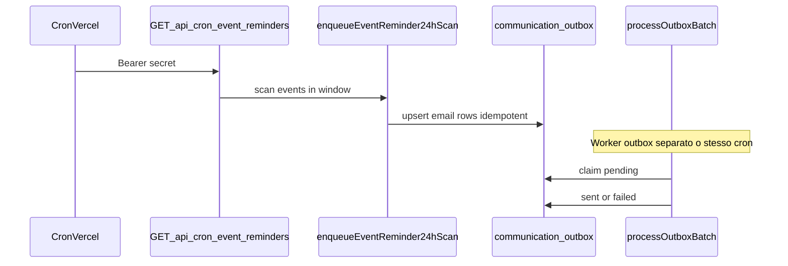

# Design: V2 comunicazioni automatizzate (`v2-comms-automation`)

Riferimenti: [PRD.md](../PRD.md) §4.3, [ROADMAP.md](../ROADMAP.md) criteri §254–258, outbox esistente in [`supabase/migrations/20260404170000_gamestore_v1.sql`](../supabase/migrations/20260404170000_gamestore_v1.sql).

## 1. Obiettivo

Reminder evento, messaggi segmentati e flussi waitlist **senza** bypass dell’outbox: tutto passa da `communication_outbox` con `idempotency_key` stabile, processato dal worker [`lib/comms/process-outbox.ts`](../lib/comms/process-outbox.ts).

## 2. Vincoli (ROADMAP)

| Vincolo | Implicazione |
|---------|----------------|
| Nessun duplicato | `ON CONFLICT (idempotency_key) DO NOTHING` / upsert come [`lib/comms/enqueue.ts`](../lib/comms/enqueue.ts) |
| Worker / cron | Stesso pattern Bearer di [`app/api/cron/outbox/route.ts`](../app/api/cron/outbox/route.ts); job dedicati per enqueue-only |
| Staff non bypassa outbox | UI admin solo **enqueue** o **trigger scan** che inserisce righe outbox, niente `sendEmail` diretto dal browser |
| Metriche minime | Query su `communication_outbox` per `sent` / `failed` per `kind` (in `payload`) |

## 3. Modello messaggi (payload `kind`)

Estensioni additive al JSON (non regole business in jsonb critico oltre a `kind`, `event_id`, `user_id`):

| kind | Quando | idempotency_key (pattern) |
|------|--------|----------------------------|
| `event_reminder_24h` | ~24h prima di `events.starts_at` | `event_reminder_24h:{event_id}:{user_id}` |
| (futuro) `event_reminder_7d` | 7 giorni prima | `event_reminder_7d:{event_id}:{user_id}` |
| `campaign_segment` | Campagna staff (`/admin/comms`: newsletter opt-in o marketing consent) | `campaign:{segment}:{campaign_id}:{user_id}` |
| (futuro) `waitlist_digest` | Digest posizione waitlist | `waitlist_digest:{registration_id}:{period}` |

## 4. Flusso reminder 24h

- **Finestra temporale:** eventi `published` con `starts_at` tra `now + 22h` e `now + 30h` (tollera cron ogni 6h; idempotenza evita doppi invii).
- **Destinatari:** iscrizioni con `status` in (`confirmed`, `waitlisted`, `pending_payment`).
- **Canale:** `email`; `scheduled_at = now()` (invio al prossimo passaggio worker).

## 5. UI staff minima

- Pagina [`/admin/comms`](../app/admin/comms/page.tsx): descrizione flusso + pulsante “Esegui scan reminder ora” (server action staff) per test/manuale senza attendere cron.

## 6. Testing

- Unit: logica di calcolo finestra / chiavi (mock client).
- Integrazione: dopo `supabase db reset` locale, evento + iscrizione + scan + `processOutboxBatch` (opzionale script).

## 7. Incrementi futuri

- Reminder 7d / multi-fuso orario per `starts_at`.
- Campagne: tabella `comms_campaigns` (metadati campagna, stato, owner staff), enqueue batch da record campagna, audit log append-only sulle azioni staff.
- Vista SQL `v_outbox_stats_by_kind` per metriche.
- Allineamento payload: campo `segment_kind` su `campaign_segment` per tracciabilità (già inviato dal worker verso il template email).

## 8. Implementato in repo (primo slice)

- [`lib/comms/event-reminders.ts`](../lib/comms/event-reminders.ts) — scan finestra 22h–30h, enqueue `event_reminder_24h`.
- [`app/api/cron/event-reminders/route.ts`](../app/api/cron/event-reminders/route.ts) — GET con Bearer come outbox.
- [`lib/comms/process-outbox.ts`](../lib/comms/process-outbox.ts) — template email `event_reminder_24h` e `campaign_segment`.
- [`app/admin/comms/page.tsx`](../app/admin/comms/page.tsx) — trigger manuale scan (staff) e form campagna newsletter opt-in.
- [`lib/comms/campaign-segment-enqueue.ts`](../lib/comms/campaign-segment-enqueue.ts) — enqueue batch idempotente `campaign_segment` (segmenti `newsletter_opt_in` e `marketing_consent`; chiave `campaign:{segment}:{id}:{user}`).
- [`vercel.json`](../vercel.json) — cron ogni 6 ore sul path sopra.
