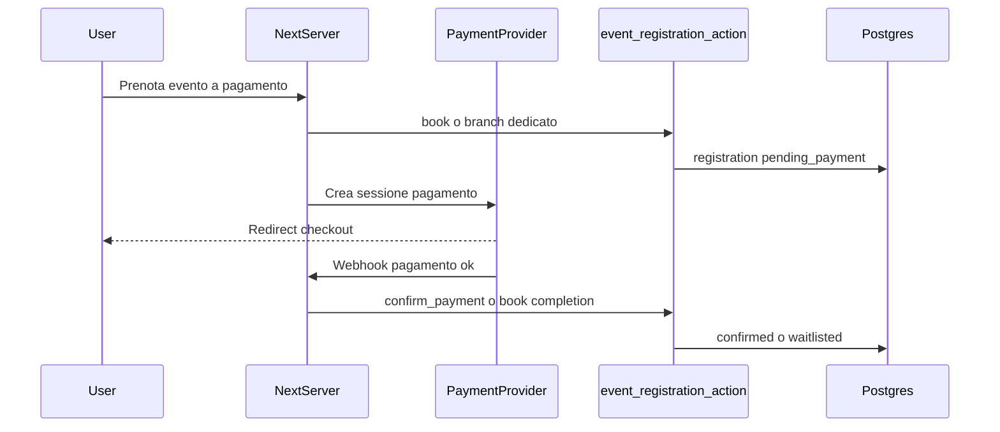

# Design review: V2 event payments (`v2-event-payments`)

Riferimenti: [PRD.md](../PRD.md) §4.1, [ROADMAP.md](../ROADMAP.md) todo `v2-event-payments` e criteri di accettazione (righe ~241–247).

## 1. Obiettivo

Introdurre **pagamenti / depositi** per eventi e stati di registrazione additivi (es. in attesa di pagamento), senza violare i vincoli V1: **un solo entrypoint mutazione prenotazione** lato database (`event_registration_action`), RLS solo tramite `has_role`, estensioni **additive** a schema ed enum.

## 2. Vincoli non negoziabili

| Vincolo | Implicazione |
|---------|----------------|
| Una RPC booking | Nessuna seconda funzione `SECURITY DEFINER` parallela per `book`/`cancel`. Nuovi branch o parametri opzionali **dentro** `event_registration_action`, oppure provider esterno che conclude il pagamento e invoca la **stessa** RPC con operazione dedicata (es. `confirm_payment` / `release_waitlist_after_pay`). |
| `registration_status` | Estensione enum **additiva** (es. `pending_payment`); default e righe esistenti invariati dopo migrazione. |
| RLS | Stessa semantica `has_role`; nessun bypass via env per admin. |
| Capacità / waitlist | Logica capacità resta **solo** in PL/pgSQL nella RPC; il client mostra solo messaggi e CTA. |

## 3. Modello dati (bozza additiva)

- **`events`:** colonne già previste nullable in V1 (`price_cents`, `currency`, `deposit_cents`) — valorizzare dove serve; eventuale `payment_provider` / `external_price_id` solo se necessario e sempre non critico per regole core (preferire tabella figlia `event_payment_settings` se cresce).
- **`event_registrations`:** nullable per riferimento pagamento esterno (`payment_intent_id`, `paid_at`, importi) con vincolo “se `pending_payment` allora …” a livello RPC/constraint, non in client.
- **Enum:** `ALTER TYPE ... ADD VALUE` per `pending_payment` (e futuri stati) in migrazione dedicata; aggiornare tipi TypeScript generati o mapping manuale in `lib/domain`.

## 4. Flussi pagamento — decisioni sprint 1 (bozza repo)

| Decisione | Scelta (sprint 1) |
|-----------|-------------------|
| Provider / modello | **Opzione A:** Stripe Checkout (o equivalente) + webhook Next verificato; nessun bypass staff per il happy path. Opzione B resta fallback documentato per eventi senza integrazione. |
| Deposito vs intero | Stesso flusso: `events.deposit_cents` vs `events.price_cents` distingue importo sessione; RPC e provider ricevono importo calcolato lato server. |
| Scadenza pagamento | Timeout tramite **cron esistente** (o job dedicato minimo) che invoca la RPC con operazione `expire_payment` (o `cancel` branch dedicato) — niente cancellazione solo da client. |

L’enum `registration_status` include già il valore additivo `pending_payment` (migrazione `20260413180000_registration_status_pending_payment.sql`); i branch RPC e le colonne su `event_registrations` (es. `payment_intent_id`) sono **step successivi** in PR dedicate.

## 4.1 Operazioni RPC additive (nomi per commento SQL / contratto)

Da aggiungere come branch nella **stessa** `event_registration_action` (firma estesa con parametri opzionali), documentati in testo sopra la funzione in migrazione:

- `confirm_payment` — webhook/stripe: idempotente su coppia `(event_id, user_id)` o `registration_id`.
- `expire_payment` — cron: transizione da `pending_payment` a `cancelled` (o politica definita in review tecnica).
- Eventuale `staff_mark_paid` — solo se serve Opzione B; gated `has_role('staff')` dentro la RPC, mai da client diretto su tabella.

## 5. UI / UX

- Utente: stato **In attesa di pagamento** su `/events` e dettaglio iscrizione; CTA “Completa pagamento” finché valida sessione.
- Staff: in `/admin/events/...` colonna stato e azioni consentite dalla policy (nessuna logica capacità nel componente).
- Nessuna duplicazione di regole: messaggi derivano da enum + copy statica.

## 6. Outbox / email

- Conferma pagamento / ricevuta: nuovi tipi messaggio con `idempotency_key` stabile (`payment:confirmed:{registration_id}`) coerente con [criteri `v2-comms-automation`](../ROADMAP.md) (riuso outbox).

## 7. Testing

- Unit: dominio che mappa operazioni verso RPC con nuovi parametri mockati.
- Migrazione: test su DB shadow o `supabase db reset` locale con enum esteso.
- Smoke: estendere `scripts/smoke-test-booking.mjs` (o script dedicato) con percorso `pending_payment` **solo** se esiste ambiente con chiavi test / flag mock provider (evitare carta reale in CI).

## 8. Checklist pre-implementazione

- [x] Provider e modello (A vs B) approvati — **A** come default sprint 1 (tabella §4).
- [x] Lista operazioni RPC additive nominata — §4.1 (`confirm_payment`, `expire_payment`, opz. `staff_mark_paid`).
- [x] Migrazione enum additiva — applicata in repo (`pending_payment`); colonne pagamento su `event_registrations` in PR successiva.
- [x] Wireframe minimo — testi stato in UI: etichetta `pending_payment` in [`lib/gamestore/data.ts`](../lib/gamestore/data.ts) (`formatRegistrationStatus`); CTA pagamento e schermate staff in PR dedicate.

Il todo YAML `v2-event-payments` in [ROADMAP.md](../ROADMAP.md) è **`in_progress`**. Prossime PR consigliate: (1) estensione `event_registration_action` + tipi dominio; (2) Stripe webhook + env; (3) UI `/events` e admin.
