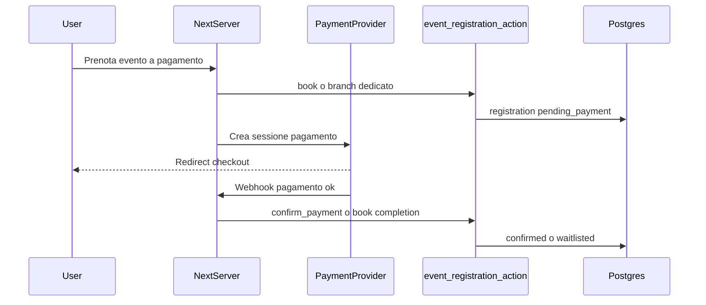

# Design review: V2 event payments (`v2-event-payments`)

Riferimenti: [PRD.md](../PRD.md) §4.1, [ROADMAP.md](../ROADMAP.md) todo `v2-event-payments` e criteri di accettazione (righe ~241–247).

## 1. Obiettivo

Introdurre **pagamenti / depositi** per eventi e stati di registrazione additivi (es. in attesa di pagamento), senza violare i vincoli V1: **un solo entrypoint mutazione prenotazione** lato database (`event_registration_action`), RLS solo tramite `has_role`, estensioni **additive** a schema ed enum.

## 2. Vincoli non negoziabili

| Vincolo | Implicazione |
|---------|----------------|
| Una RPC booking | Nessuna seconda funzione `SECURITY DEFINER` parallela per `book`/`cancel`. Nuovi branch o parametri opzionali **dentro** `event_registration_action`, oppure provider esterno che conclude il pagamento e invoca la **stessa** RPC con operazione dedicata (es. `confirm_payment` / `release_waitlist_after_pay`). |
| `registration_status` | Estensione enum **additiva** (es. `pending_payment`); default e righe esistenti invariati dopo migrazione. |
| RLS | Stessa semantica `has_role`; nessun bypass via env per admin. |
| Capacità / waitlist | Logica capacità resta **solo** in PL/pgSQL nella RPC; il client mostra solo messaggi e CTA. |

## 3. Modello dati (bozza additiva)

- **`events`:** colonne già previste nullable in V1 (`price_cents`, `currency`, `deposit_cents`) — valorizzare dove serve; eventuale `payment_provider` / `external_price_id` solo se necessario e sempre non critico per regole core (preferire tabella figlia `event_payment_settings` se cresce).
- **`event_registrations`:** nullable per riferimento pagamento esterno (`payment_intent_id`, `paid_at`, importi) con vincolo “se `pending_payment` allora …” a livello RPC/constraint, non in client.
- **Enum:** `ALTER TYPE ... ADD VALUE` per `pending_payment` (e futuri stati) in migrazione dedicata; aggiornare tipi TypeScript generati o mapping manuale in `lib/domain`.

## 4. Flussi pagamento (da decidere prima del codice)

**Opzione A (consigliata per chiarezza):** Stripe (o analogo) Checkout + webhook su Route Handler Next che, dopo verifica firma, chiama `supabase.rpc('event_registration_action', { p_operation: 'confirm_payment', ... })` con idempotenza lato RPC (stesso utente/evento).

**Opzione B:** Pagamento completamente esterno (link manuale); staff marca pagato — minore automazione, stessa RPC con operazione staff-only se coerente con RLS (verificare che sia solo `has_role('staff')` via RPC security).

Decisioni da chiudere in review:

- Provider unico per V2 prima iterazione?
- Deposito vs prezzo intero: stesso flusso con flag su `events`?
- Scadenza pagamento: timeout che torna a `cancelled` solo via RPC schedulata o job?

## 5. UI / UX

- Utente: stato **In attesa di pagamento** su `/events` e dettaglio iscrizione; CTA “Completa pagamento” finché valida sessione.
- Staff: in `/admin/events/...` colonna stato e azioni consentite dalla policy (nessuna logica capacità nel componente).
- Nessuna duplicazione di regole: messaggi derivano da enum + copy statica.

## 6. Outbox / email

- Conferma pagamento / ricevuta: nuovi tipi messaggio con `idempotency_key` stabile (`payment:confirmed:{registration_id}`) coerente con [criteri `v2-comms-automation`](../ROADMAP.md) (riuso outbox).

## 7. Testing

- Unit: dominio che mappa operazioni verso RPC con nuovi parametri mockati.
- Migrazione: test su DB shadow o `supabase db reset` locale con enum esteso.
- Smoke: estendere `scripts/smoke-test-booking.mjs` (o script dedicato) con percorso `pending_payment` **solo** se esiste ambiente con chiavi test / flag mock provider (evitare carta reale in CI).

## 8. Checklist pre-implementazione

- [ ] Provider e modello (A vs B) approvati.
- [ ] Lista operazioni RPC additive nominata e documentata in commento SQL.
- [ ] Migrazione enum + colonne revisionata (nessuna DROP di valori enum esistenti).
- [ ] Wireframe minimo stati utente/staff accettato.

Quando la checklist è completata, aggiornare il todo YAML `v2-event-payments` nel frontmatter di `ROADMAP.md` (es. `in_progress`) e aprire PR con migrazione + dominio + UI in commit separati se possibile (migrazione prima).
